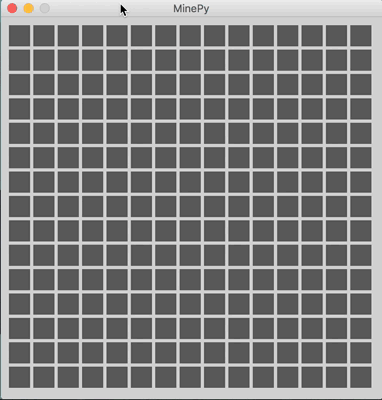

# Meet MinePy
A '17 take on a 70s game !

 

  

### What's cool ?
- Modular approach with OOP - game, board and cell
- Tunable parameters (use `constants.py`)
- Flood fill algorithm
- Multi-threading to avoid render blocking

### Build & run

1. Install [python_sdl](https://github.com/renpy/pygame_sdl2) for your platform
2. Clone the `conda` environment using `conda env create -f environment.yml`
3. Activate the environment - `source activate minesweeper_pygame`
4. Run the game !
    - `python3 game.py`

### Dependencies
- `pygame_sdl2`

### Todo

- [ ] Implement flagging system
